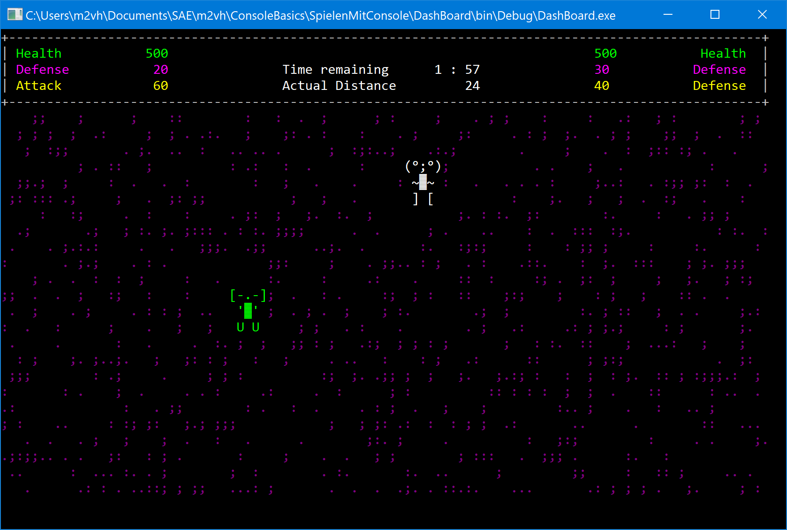

# Hello World!

Welcome to my project page. Nice to have you here.

## Why this page exists?

This project follows the recommendations of a work sheet from the games programming class GPD318 at SAE Institute Cologne.

Goal of this class is the introduction of `Object Orientated Programming (OOP)`. 

In this project I wanted to show the abilities and borders of a Console-App written in C# using Visual Studio 2017.

## And this is how it looks like

 

<video  style="display:block; width:100%; height:auto;" autoplay controls loop="loop">
<source src="./Video/MonsterHunter.mp4" type="video/mp4">
</video>

## Game Design Document

- Create three types of `Monster`.
- Each `Monster` contains a property of `Health`, `Attac` and `Defense`.
- The `Player` can choose his type of `Monster`.
- The `Game` selects the opponent randomly.
- In each `Round` the `Monster` attac each other and new `Health` is calculated.
- The `Fight` is limited by `Time`.
- The `Game` ends if one `Monster` dies or no `Time` is left.
- `Winner` is the `Monster` with most `Health` at end of `Game`.

## You want to see it on your computer?

Fork the repository, open the `SpielenMitConsole.sln` in Visual Studio, build your version and have some fun.

